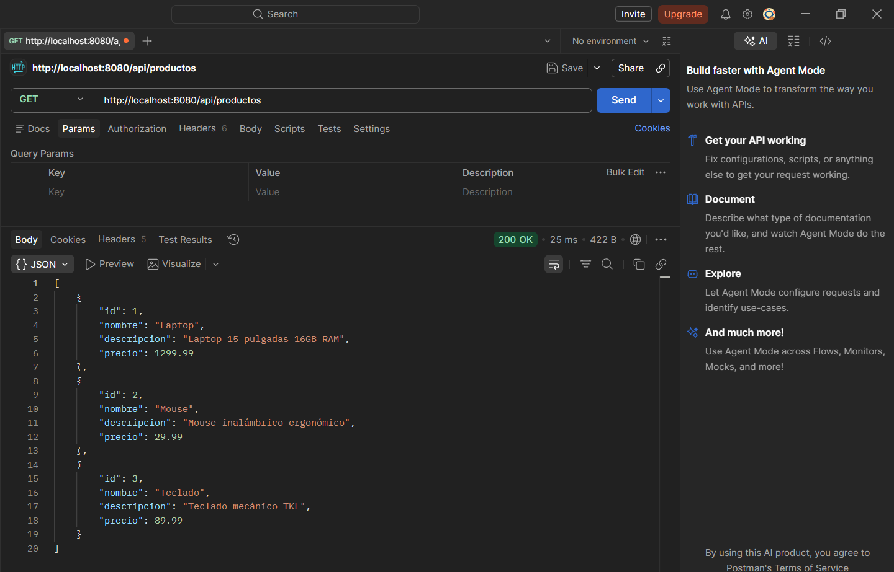
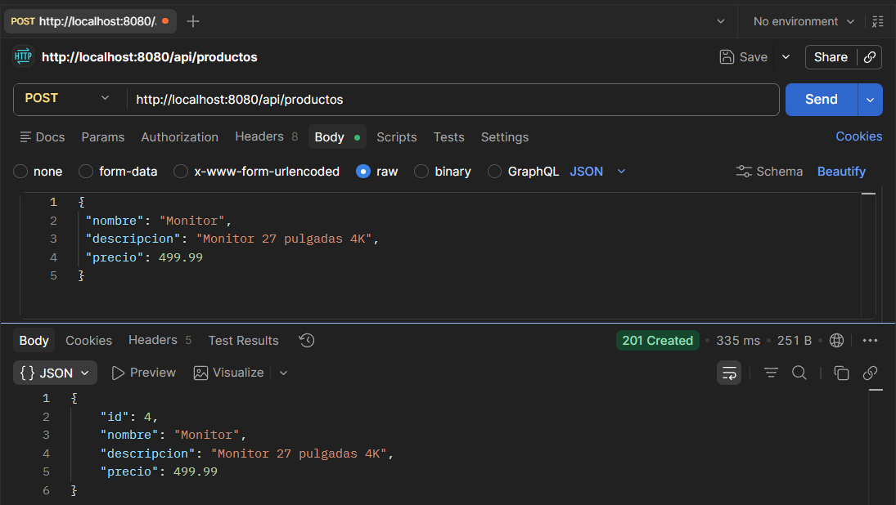
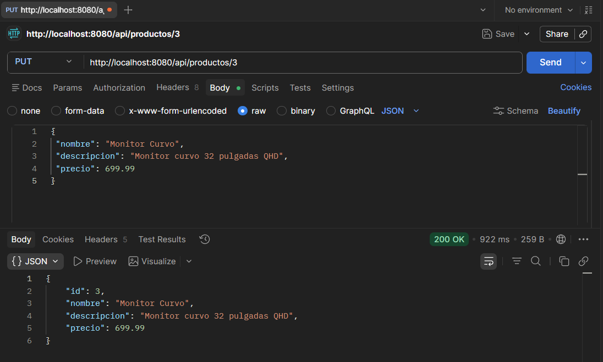
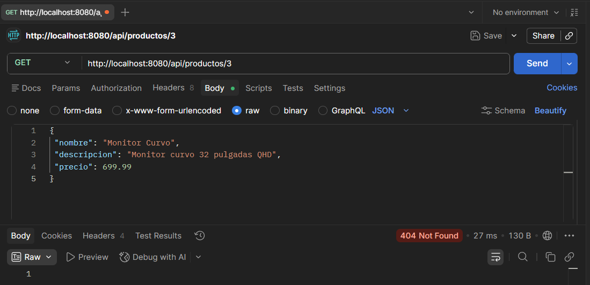
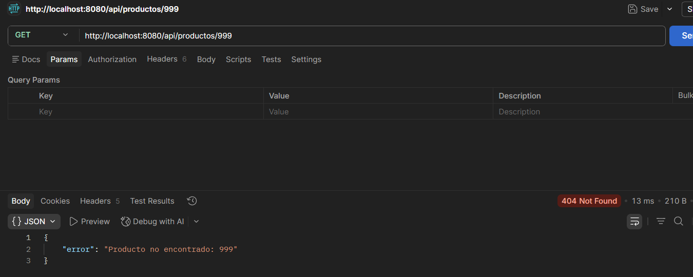

# API REST de Productos con Spring Boot

## 📌 Descripción del Proyecto
Este proyecto consiste en el desarrollo de una API REST utilizando Spring Boot para la gestión de productos.  
La API permite realizar operaciones CRUD (Crear, Leer, Actualizar y Eliminar) sobre una colección de productos almacenados en memoria.

Se implementa el uso de:
- @RestController
- ResponseEntity
- Manejo de errores global con @RestControllerAdvice

---

## ⚙️ Prerrequisitos

- Java JDK 17 o superior
- Maven 3.8+ (o usar mvnw)
- Postman o Thunder Client

---

## 🚀 Ejecución del Proyecto

1. Clonar el repositorio:
   git clone https://github.com/AndressToscanom30/toscano-post2-u7
   cd productos-web

2. Ejecutar el proyecto:
   mvn spring-boot:run

3. Acceder a:
   http://localhost:8080/api/productos

---

## 📡 Endpoints de la API

| Método | Endpoint | Descripción | Código |
|--------|--------|------------|--------|
| GET | /api/productos | Listar productos | 200 OK |
| GET | /api/productos/{id} | Obtener producto | 200 / 404 |
| POST | /api/productos | Crear producto | 201 |
| PUT | /api/productos/{id} | Actualizar producto | 200 / 404 |
| DELETE | /api/productos/{id} | Eliminar producto | 204 / 404 |

---

## 🧪 Evidencia

### GET


### POST


### PUT


### DELETE


### Manejo de errores global


---

## 🛠️ Funcionalidades

- CRUD completo
- Manejo de errores global
- Respuestas JSON
- Uso correcto de códigos HTTP

---

## 📁 Estructura

```
src/
└── main/
├── java/com/universidad/apiproductos/
│    ├── controller/
│    ├── model/
│    ├── service/
└── resources/
```

---

## 📄 Notas

- Datos en memoria (HashMap)
- Sin base de datos
- Manejo de errores centralizado